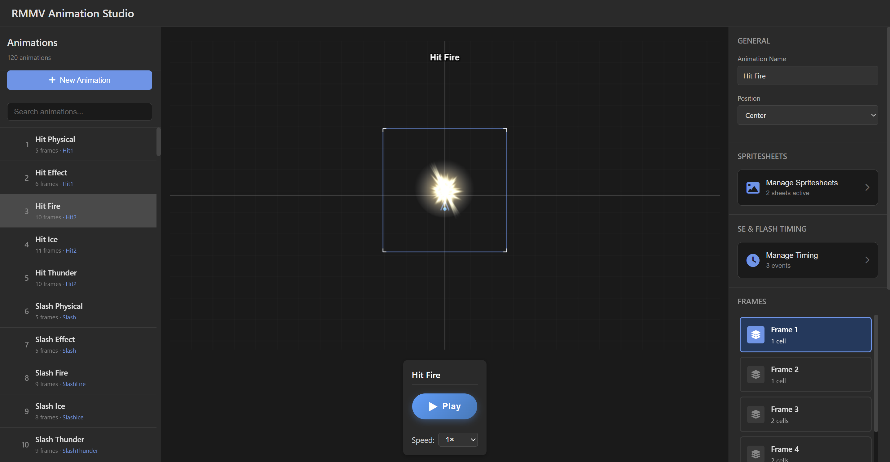
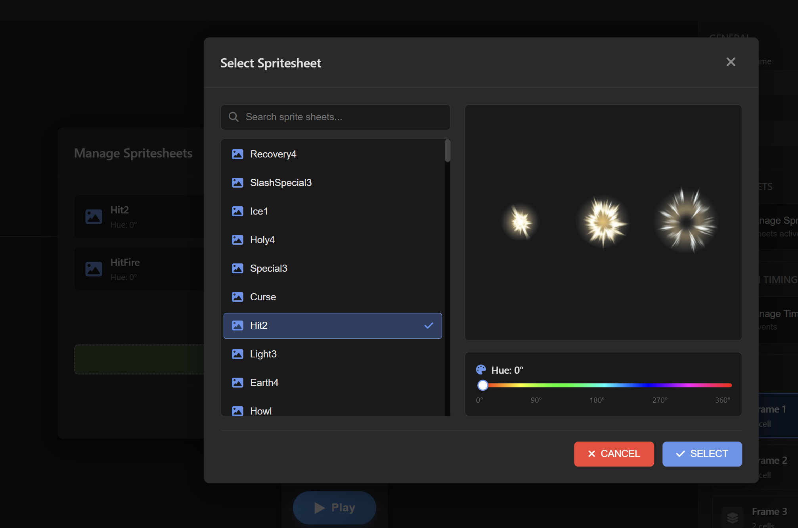
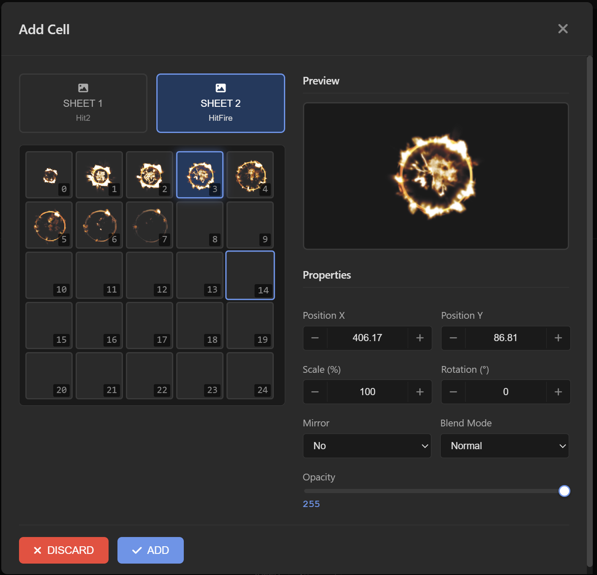
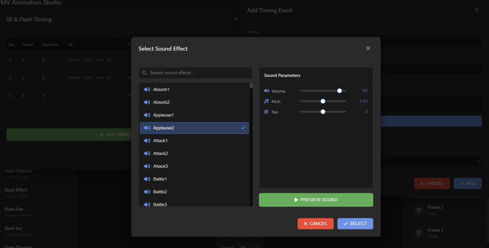
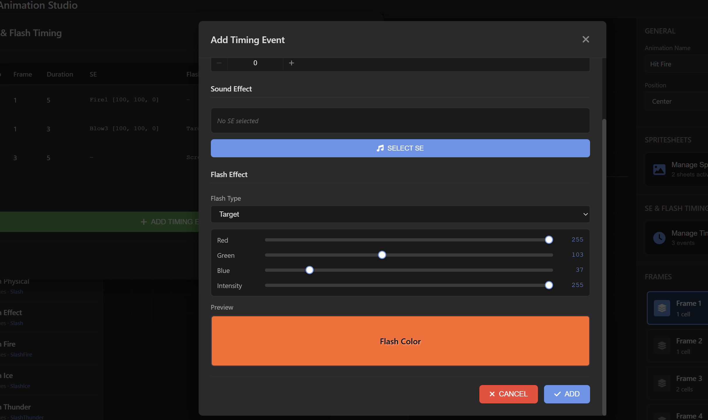

# RMMV Animation Studio

A monorepo containing tools for RPG Maker MV animations: a standalone animation player and a web-based animation studio.

# Screenshoots

**Main Dashboard**


**Sprite Sheet Configuration**


**Sprite Cell Editor**


**Sound Effects Setup**


**Timing and Flash Effects**


## Packages

### [@decky.fx/rmmv-animation-player](packages/player/)

Standalone animation player for Phaser 3 projects.

- 📦 **NPM Package**: Install and use in any Phaser project
- 🎯 **Framework-Agnostic**: Works with any Phaser setup
- 🔊 **Full Feature Support**: Cells, timings, sound effects, blend modes
- 📘 **TypeScript**: Complete type definitions and documentation

See [packages/player/README.md](packages/player/README.md) for detailed documentation.

### [@decky.fx/rmmv-animation-studio](packages/studio/)

Web application for reading, playing, and editing RMMV animations.

- 📋 **Animation List**: Browse all available animations
- 🎮 **Phaser Preview**: Real-time animation preview with 16:9 aspect ratio
- 🛠️ **Toolbox**: Edit animation properties, timing, and frames
- 🔄 **Lazy Asset Loading**: Efficient memory usage with on-demand asset loading
- 💾 **Database Persistence**: SQLite database with Drizzle ORM
- 📤 **Export/Import**: Export animations as portable JSON configs
- 🐳 **Docker Support**: One-command deployment with docker-compose

## Monorepo Structure

```
rmmv-animation-studio/
├── packages/
│   ├── player/              # @decky.fx/rmmv-animation-player
│   │   ├── src/
│   │   │   ├── types/       # TypeScript definitions
│   │   │   ├── parsers/     # Animation parsers
│   │   │   ├── player/      # AnimationPlayer class
│   │   │   ├── loader/      # Asset loader
│   │   │   └── cli/         # CLI validation tool
│   │   ├── dist/            # Built package (generated)
│   │   └── package.json
│   └── studio/              # @decky.fx/rmmv-animation-studio
│       ├── src/
│       │   ├── server/      # Bun server
│       │   ├── phaser/      # Phaser integration
│       │   ├── react/       # React UI
│       │   ├── db/          # Database layer
│       │   └── config/      # Config generators
│       ├── assets/
│       │   ├── data/        # Animations.json
│       │   └── img/         # Sprite sheets
│       └── package.json
└── package.json             # Root workspace config
```

## Getting Started

### Prerequisites

- [Bun](https://bun.sh) v1.0 or higher

### Quick Start

For first-time setup (installs dependencies + builds player package):

```bash
bun run setup
```

Or manually:

```bash
# Install all workspace dependencies
bun install

# Build player package (required for studio type checking)
bun run build:player
```

### Development

Run the studio in development mode:

```bash
bun run dev
```

Open http://localhost:10021 in your browser.

**Note**: The player package must be built before the studio can type-check successfully, as the studio imports types from the built player package.

### Building

Build both packages:

```bash
bun run build
```

Or build individually:

```bash
bun run build:player
bun run build:studio
```

### Type Checking

Type check all packages:

```bash
bun run typecheck
```

Or check individually:

```bash
bun run typecheck:player
bun run typecheck:studio
```

### Production

Run the studio in production mode:

```bash
bun run start
```

### Docker Deployment

Deploy the studio with Docker:

```bash
# Build and start container
docker-compose up -d

# View logs
docker-compose logs -f

# Stop container
docker-compose down
```

The application will be available at http://localhost:10021

For detailed Docker deployment instructions, see [DOCKER.md](DOCKER.md).

## Using the Animation Player

Install the player package in your Phaser project:

```bash
npm install @decky.fx/rmmv-animation-player
# or
bun add @decky.fx/rmmv-animation-player
```

Quick example:

```typescript
import Phaser from 'phaser';
import { AnimationPlayer } from '@decky.fx/rmmv-animation-player';
import type { AnimationConfig } from '@decky.fx/rmmv-animation-player';

class GameScene extends Phaser.Scene {
  async create() {
    // Load animation config (exported from studio)
    const config: AnimationConfig = await fetch('/animations/Fireball_export.json')
      .then(r => r.json());

    // Create player
    const player = new AnimationPlayer(this, config);

    // Preload assets
    await player.preload();

    // Play at position
    player.play({ x: 400, y: 300 }, {
      loop: false,
      speed: 1.0,
      onComplete: () => console.log('Animation finished!'),
    });
  }
}
```

For comprehensive documentation, see [packages/player/README.md](packages/player/README.md).

## Setting Up RPG Maker MV Assets

**IMPORTANT**: This repository does NOT include RPG Maker MV's animation assets due to licensing restrictions. You must obtain these assets separately.

### Required Assets

You need the following from RPG Maker MV's Run Time Package (RTP):

```
assets/
├── data/
│   └── Animations.json          # Animation definitions
├── img/
│   └── animations/              # Sprite sheets (192×192px cells, 5×5 grids)
│       ├── Absorb.png
│       ├── Fire1.png
│       └── ... (all .png files)
└── se/                          # Sound effects
    ├── Absorb1.ogg
    ├── Fire1.ogg
    └── ... (all .ogg or .m4a files)
```

### How to Obtain

**Option 1: If you own RPG Maker MV**

1. Locate your RPG Maker MV installation
2. Copy files to this project:
   - `<RPG Maker MV>/data/Animations.json` → `./assets/data/`
   - `<RPG Maker MV>/img/animations/*.png` → `./assets/img/animations/`
   - `<RPG Maker MV>/audio/se/*.ogg` → `./assets/se/`

**Option 2: Download RPG Maker MV Trial/RTP**

1. Visit https://www.rpgmakerweb.com/
2. Download RPG Maker MV trial or RTP package
3. Extract and copy assets as described above

See [assets/README.txt](assets/README.txt) for detailed instructions.

### License Notice

Animation assets are:
- Copyright © 2015 KADOKAWA CORPORATION / YOJI OJIMA
- Licensed under RPG Maker MV's terms of use
- You must own a valid RPG Maker MV license to use these assets


## Workspace Commands

### Root Commands

```bash
# Setup & Development
bun run setup          # First-time setup (install + build player + seed DB)
bun run dev            # Run studio dev server

# Building
bun run build          # Build all packages
bun run build:player   # Build player package
bun run build:studio   # Build studio package

# Quality Checks
bun run typecheck      # Type check all packages
bun run test           # Run tests

# Database
bun run db:seed        # Run migrations and seed database

# Cleanup
bun run clean          # Clean node_modules and dist folders
bun run clean:all      # Clean everything including data directory
```

### Player Package Commands

```bash
cd packages/player
bun run build          # Build player package
bun run typecheck      # Type check player
bun test               # Run player tests
```

### Studio Package Commands

```bash
cd packages/studio
bun run dev            # Run dev server
bun run build          # Build studio
bun run typecheck      # Type check studio
bun run lint           # Lint studio code
bun run db:seed        # Seed database
```

## Documentation

- [CLAUDE.md](CLAUDE.md) - Project overview and development guide
- [Player README](packages/player/README.md) - Animation player documentation
- [DOCKER.md](DOCKER.md) - Docker deployment guide

The studio package is private and not intended for publication.

## License

MIT License - see [LICENSE](LICENSE) file for details.